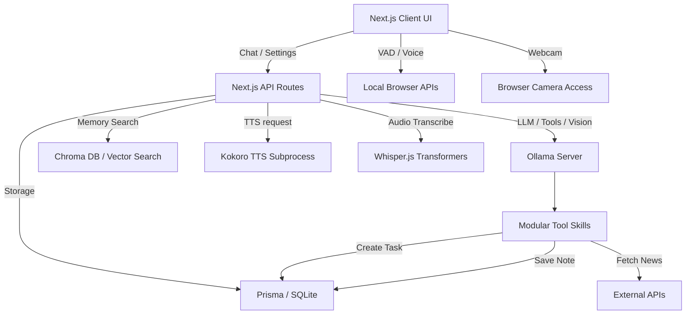

# Niko OS Architecture

Niko OS is designed as a locally-hosted, privacy-first AI assistant. All processing, reasoning, memory extraction, and media generation happen locally using open-source models. 

## System Overview

## Key Components

1. **Frontend (React / Next.js)**: The main user interface providing a chat experience, visual rendering, local Voice Activity Detection (VAD) via Silero, and a unified settings panel.
2. **Local AI Engine (Ollama)**: Powers all heavy reasoning. Runs models like `llama3.2` for chat, `nomic-embed-text` for vectorizing text, and `llava` for Vision Mode.
3. **Transcription (`/api/transcribe`)**: Uses `@xenova/transformers` to run an ONNX version of Whisper locally in Node.js, ensuring offline transcription.
4. **Speech Synthesis (`/api/tts`)**: Calls out to a local python subprocess running Kokoro ONNX, rendering highly expressive local TTS audio.
5. **Memory System**: Uses background prompt analysis to silently extract facts and preferences from conversation, storing them in SQLite and querying them contextually using embeddings.
6. **Skills & Tools**: Modular toolsets dynamically exposed to Ollama (via Function Calling).
7. **Demo Mode**: A recruiter-friendly toggle that intercepts tool execution, ensuring safe demonstrations.

## Hardware Integration
- **Microphone**: Monitored locally by Silero VAD. Only streams audio snippets to `/api/transcribe` when speech is detected.
- **Camera**: Accessible via Picture-in-Picture for Vision Mode. Captures single frames when a user speaks or submits a message, forwarding to `llava` for multimodal context.

## Privacy & Security
- **No Cloud Dependency**: By default, everything except `npm` dependencies runs offline.
- **Local SQLite**: User data never leaves the machine.
- **Encrypted Backups**: Allows users to export and import AES-256-GCM encrypted snapshots of their memories, tasks, and settings.
